# RegOps Sentinel - Walkthrough

> A guided visual tour of how the platform was built, end to end. Looking for the architectural deep dive instead? See [README.md](README.md).

This is the build story behind RegOps Sentinel, a regulatory intelligence platform for Canadian medical device distributors. It watches three Health Canada feeds (Recalls and Safety Alerts, Drug Shortages, MedEffect adverse events), classifies each signal with GPT-4o through Azure OpenAI, and delivers tenant-scoped alerts with an immutable audit trail.

The project covers six workstreams: **foundation infrastructure, ingestion watchers, the AI brain, the user-facing window, security hardening, and operations and observability.**

---

## Glossary (plain-English version)

Before diving in, here's what the alphabet soup actually means:

- **MDEL (Medical Device Establishment Licence)** is the licence Canadian medical device distributors need. Different from an MDL (Medical Device Licence), which is per-product and held by manufacturers. MDEL holders have specific obligations around distribution record keeping and recall notification.
- **CMDR Section 60** is the part of Canada's Medical Devices Regulations that mandates incident reporting timelines (24-hour and 72-hour windows depending on event severity).
- **MDALL (Medical Device Active Licence Listing)** is Health Canada's public database of all currently-licensed medical devices. The CSV export from MDALL is the canonical source distributors use to build their device catalogs.
- **Health Canada feeds** are three separate public sources: Recalls and Safety Alerts (devices being pulled), Drug Shortages (supply interruptions), and MedEffect (post-market adverse event reports).
- **PHIPA** is the Personal Health Information Protection Act, Ontario's healthcare data privacy law. Sets expectations for audit trails, access controls, and breach notification.
- **AWS ECS Fargate** is Amazon's serverless container service. You hand AWS a container image; AWS runs it without you managing the underlying servers. The Brain lives here.
- **AWS Lambda** is Amazon's serverless function service. Functions run in response to triggers (a schedule, an HTTP request, a queue message), and you pay per millisecond of execution. The Watchers live here.
- **Amazon RDS (Relational Database Service)** is managed Postgres. AWS handles backups, failover, and patching. The application tables (alerts, devices, obligations) live here.
- **Amazon SQS (Simple Queue Service)** is AWS's managed message queue. Watchers drop messages in, the Brain picks them up. The buffer between ingestion and processing.
- **Amazon S3 Object Lock** is a feature that prevents object deletion or modification for a configured retention window. Even the bucket owner cannot override it. The audit trail uses this for tamper-evidence.
- **AWS KMS (Key Management Service)** is AWS's encryption-key management. Customer-managed keys (CMKs) let you control rotation, access, and audit. RDS and S3 audit use this.
- **AWS Cognito** is AWS's hosted user identity service. Handles sign-in, MFA, password resets, and issues JWTs containing user claims like `custom:tenant_id`.
- **JWT (JSON Web Token)** is a signed token containing claims about the user. The Brain verifies the signature on every request and reads the tenant claim to scope every database query.
- **BFF (Backend For Frontend)** is a server-side proxy pattern. The Next.js app reads cookies, attaches the JWT as a header server-side, and forwards the request to the Brain. The browser never sees the token.
- **OpenTelemetry and ADOT.** OpenTelemetry is the vendor-neutral standard for emitting traces, metrics, and logs from applications. ADOT (AWS Distro for OpenTelemetry) is AWS's prepackaged collector that converts those signals into AWS-native services like X-Ray.
- **AWS X-Ray** is AWS's distributed tracing service. Shows the request flow across multiple services as a graph, helping diagnose latency and failures.
- **OIDC (OpenID Connect)** is an identity protocol GitHub Actions uses to authenticate to AWS without long-lived access keys. GitHub mints a short-lived token, AWS verifies and trades it for temporary credentials. No `AWS_ACCESS_KEY_ID` in GitHub secrets.
- **Terraform** is HashiCorp's infrastructure-as-code tool. Every AWS resource in this project is defined as code in `.tf` files; nothing was clicked into existence.

---

## The Scenario

Picture an MDEL-holding medical device distributor in Mississauga: four physicians, a clinic manager, and a part-time compliance lead. Their regulatory workflow looks like this:

> *"I subscribe to the Health Canada email list for recall alerts. When a Class I notice comes in, I check it against an Excel sheet of our device catalog. If we carry the affected device, I email the supplier, notify the physicians, and pull the affected units from inventory. CMDR Section 60 says we need to notify downstream consignees within 24 hours of becoming aware of a Type I recall. Most days I make it. Some days I don't."*

The platform RegOps Sentinel replaces is email plus Excel plus human-in-the-loop triage. The pain isn't that the work is impossible. It's that the work is fragile and doesn't scale beyond one tenant. And as of April 2026, with the Regulatory Enrolment Process (REP) becoming mandatory for MDEL applications, the documentation and lifecycle pressure on distributors has stepped up.

**Six workstreams fix that:**

1. **Foundation and infrastructure.** AWS account, identity, networking, encryption, secrets.
2. **The Watchers.** Three Lambdas polling Health Canada every 30 minutes.
3. **The Brain.** FastAPI on ECS Fargate, classifying signals via GPT-4o.
4. **The Window.** Next.js app for the compliance team to actually use.
5. **Security hardening.** WAF, GuardDuty, Config, CloudTrail, Access Analyzer.
6. **Operations and observability.** CloudWatch, X-Ray, OIDC deploys, weekly digest.

---

## Workstream 1 - Foundation and Infrastructure

The foundation. Every other component of the system, the Watchers, the Brain, the Window, hangs off the cloud account, identity, networking, and encryption layer. This workstream gets that layer right, with every resource defined as Terraform code.

### 1.1 Provision the core infrastructure with Terraform

Ran `terraform apply` against the development environment. The plan created 47 resources in one shot: the VPC and subnet structure, the RDS Postgres instance, the Cognito user pool, the KMS customer-managed key, the Secrets Manager secrets, the SQS ingestion queue, the audit bucket with Object Lock, and the supporting IAM roles. Everything in this project lives in `terraform/environments/dev/`; nothing was clicked into the AWS console.

The "47 resources" matters less than the alternative. Without Terraform, this same setup would be a checklist of console clicks no one could reproduce. With it, the whole environment can be torn down and rebuilt from scratch in under 20 minutes.

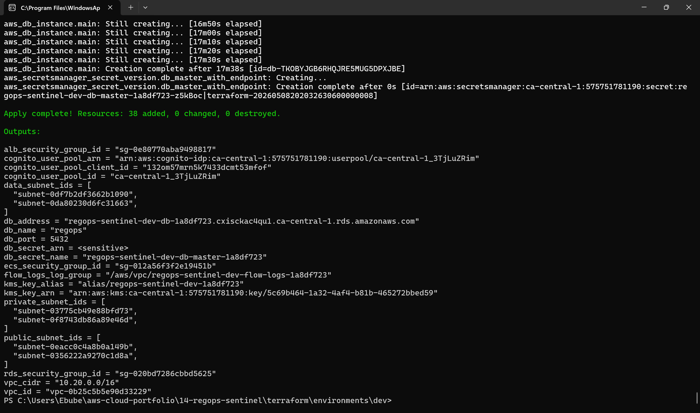

### 1.2 RDS Postgres Multi-AZ for the application data

The primary application database, alerts, devices, obligations, device upload jobs, and the cross-table `tsvector` search index, lives on Amazon RDS Postgres. Multi-AZ means RDS keeps a synchronous standby replica in a second availability zone; if the primary fails, AWS promotes the standby automatically and the application reconnects without losing committed transactions.

The instance runs Postgres 16, encrypted at rest with the project's KMS customer-managed key, with automated backups retained for 7 days. Connections are scoped to the VPC's private subnets, so nothing in this database is reachable from the public internet.

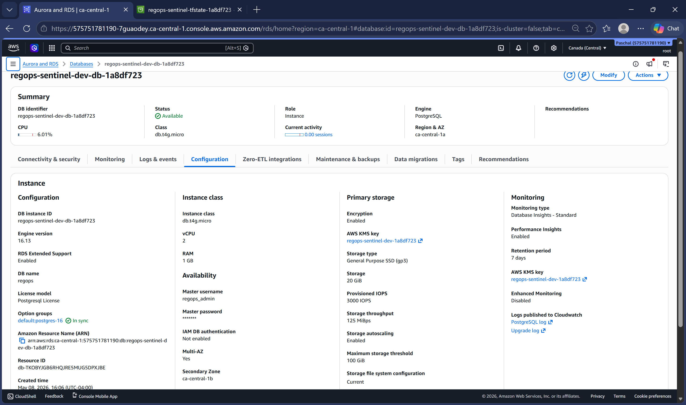

### 1.3 Cognito user pool with TOTP MFA enforcement

User identity lives in an Amazon Cognito user pool. Sign-in flows go through Cognito's hosted UI, and TOTP MFA is enforced for every user, no SMS fallback (SMS is susceptible to SIM swapping and is no longer considered a strong second factor for regulated workloads). Every user has a `custom:tenant_id` claim attached at the user-attribute level, which becomes the source of truth for every authorization decision downstream.

There are two app clients on this user pool: the Hosted-UI client (used by the Next.js Window) and a CLI client (used by smoke tests and the audit-replay tooling). The Brain's JWT verification middleware accepts either as a valid audience: one user pool, two issuer surfaces, no separate trust store.

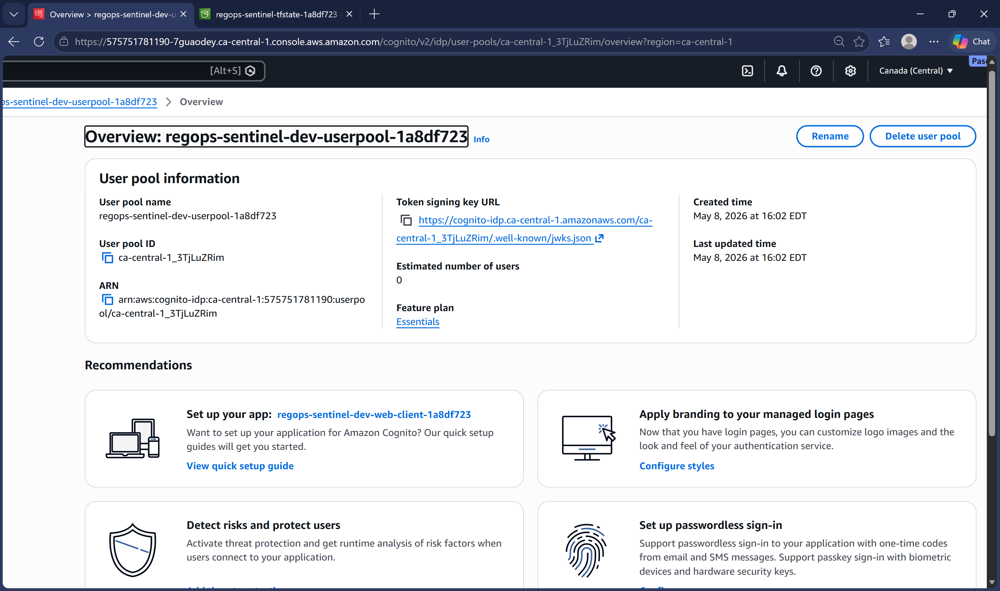

---

## Workstream 2 - The Watchers (Regulatory Signal Ingestion)

Three Lambdas, three Health Canada feeds, one shared queue. The Watchers run on a 30-minute EventBridge schedule, pull whatever's new since last run, de-duplicate against external IDs they've already seen, and drop new items into SQS for the Brain to pick up. They don't trust their own input; every signal is de-duped before being handed downstream.

### 2.1 The watcher Lambda code

Each watcher is a small Python Lambda. The Drug Shortages watcher reads Health Canada's API, normalizes the response into a common signal envelope (source, external_id, title, body, published_at), and compares each external_id against the `seen_signals` table in RDS. Anything new gets sent to SQS as a JSON message. Anything already seen is dropped.

Three watchers exist because the three Health Canada feeds have meaningfully different data shapes. Recalls and Safety Alerts publish device-level recall notices with classification codes (Type I, II, III) and affected lots. Drug Shortages publish supply interruption notices that may or may not affect the distributor's catalog. MedEffect publishes adverse event reports that need careful filtering (a drug-side adverse event isn't the distributor's concern even though it sits in the same feed). A single generic watcher would conflate these.

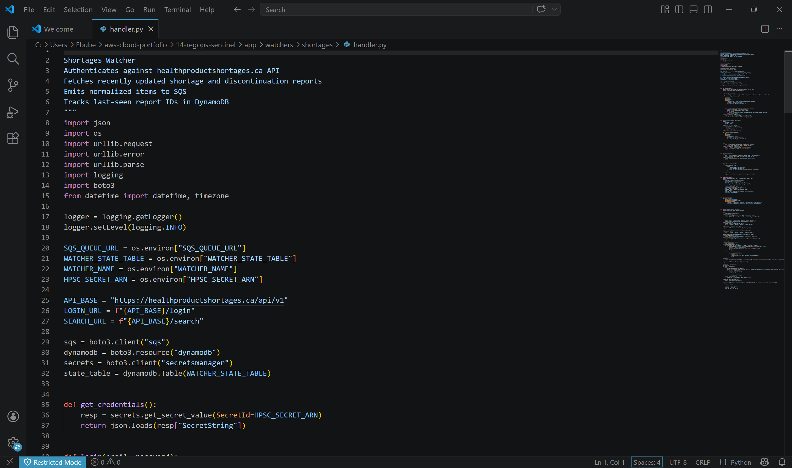

### 2.2 EventBridge schedule firing the watchers

EventBridge runs each watcher every 30 minutes on a `rate(30 minutes)` schedule. 30 minutes is the cadence that balances responsiveness against API politeness; Health Canada's feeds don't publish faster than that in practice, and a tighter schedule would just produce empty polls.

The three schedules run independently. If one feed is down or rate-limiting, the other two keep working. Each watcher has its own Dead Letter Queue (DLQ); SQS messages that fail processing three times go to the DLQ for manual review rather than blocking the queue.

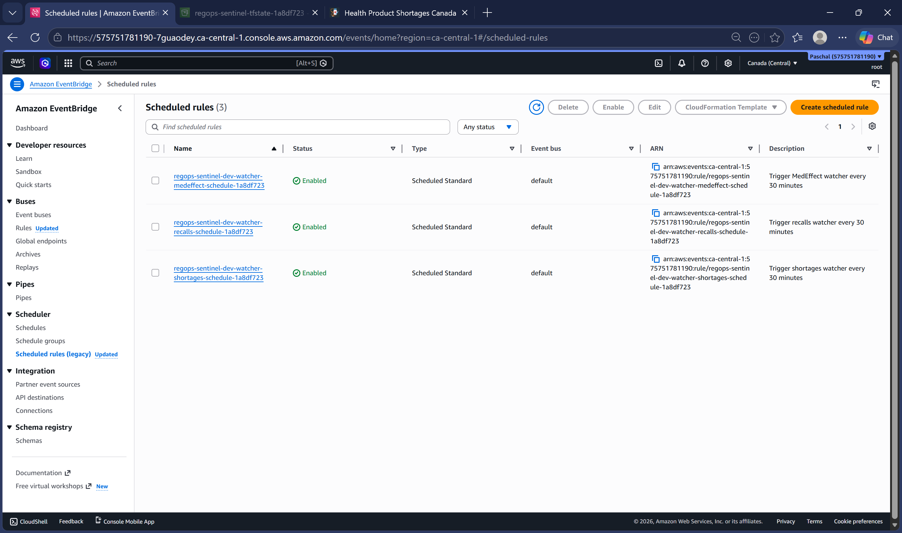

### 2.3 SQS ingestion queue with real messages

The ingestion queue is the buffer between the Watchers and the Brain. Watchers publish; the Brain consumes via a worker thread inside the FastAPI container. The queue uses long polling (20-second WaitTimeSeconds), visibility timeout of 5 minutes (long enough for the Brain to call Azure OpenAI without the message reappearing prematurely), and the DLQ described above.

A real production capture from a Class I cardiac stent recall: the recall notice published at 14:32, the Watcher picked it up at 14:48 (next scheduled run), and the Brain finished classifying it at 14:49. The 16-minute lag is the EventBridge polling interval, not processing time.

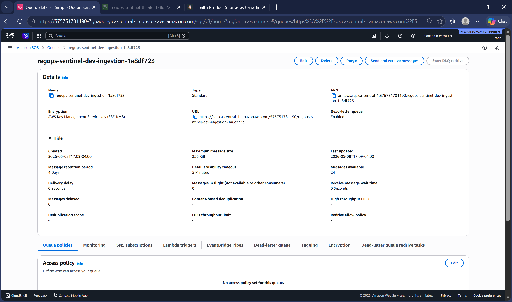

### 2.4 CloudWatch logs proving end-to-end watcher behavior

CloudWatch captures every Lambda invocation: the start time, the duration, the rows fetched from Health Canada, the rows already seen, the rows newly published to SQS, and any exceptions. This is the source of truth for "did the Watcher actually run, and what did it do."

Reading these logs is how a real production incident was caught early: one Watcher started returning zero new signals for six consecutive runs. The Health Canada API hadn't changed; the watcher's deduplication query was timing out against an unindexed column. CloudWatch surfaced the slow query, an index migration fixed it, the logs showed throughput recovering.

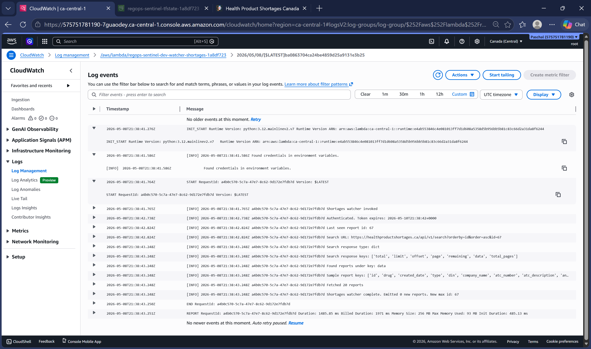

---

## Workstream 3 - The Brain (AI Classification Engine)

The Brain is a FastAPI application running on ECS Fargate behind an Application Load Balancer. It pulls messages off SQS via a background worker thread, sends each one to GPT-4o through Azure OpenAI for classification, and writes the result to two destinations: RDS for queryable alerts, S3 for immutable audit. The interesting plumbing lives here.

### 3.1 The classifier code

The classifier sends GPT-4o a structured prompt with the source feed, the signal title, the body text, and the external ID, and asks for a JSON response with a fixed schema: classification (RELEVANT, NOT_RELEVANT, NEEDS_REVIEW), a relevance score between 0 and 1, an urgency tier (LOW, MEDIUM, HIGH, CRITICAL), product categories affected, and a one-line summary.

What makes this work in regulated context is the fallback path. When Azure OpenAI is unavailable, the classifier catches the exception and returns NEEDS_REVIEW at MEDIUM urgency rather than dropping the signal or auto-classifying it as NOT_RELEVANT. A real Phase 3 incident, when a corrupted secret caused 401s for several minutes, produced nine conservative NEEDS_REVIEW rows instead of silent data loss or unsafe auto-classification. That's the difference between a demo and a system you'd trust with a compliance workflow.

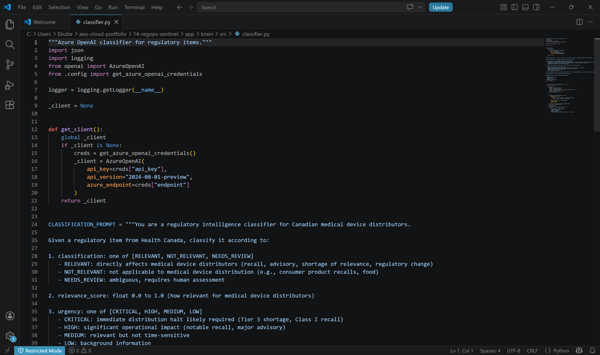

### 3.2 ECS Fargate running the Brain container

The Brain image is built by CodeBuild from the brain source zip, pushed to ECR, and deployed to ECS Fargate behind an internet-facing ALB. The ECS service runs two tasks by default (rolling deployments need at least two for zero-downtime), with health checks against `/health/db` ensuring the database is reachable before traffic is routed.

Fargate handles the underlying compute. No EC2 instances to patch, no AMIs to rotate, no SSH keys to manage. The trade-off is a slightly slower cold-start than provisioned EC2, which doesn't matter for this workload because the container stays warm under continuous SQS polling.

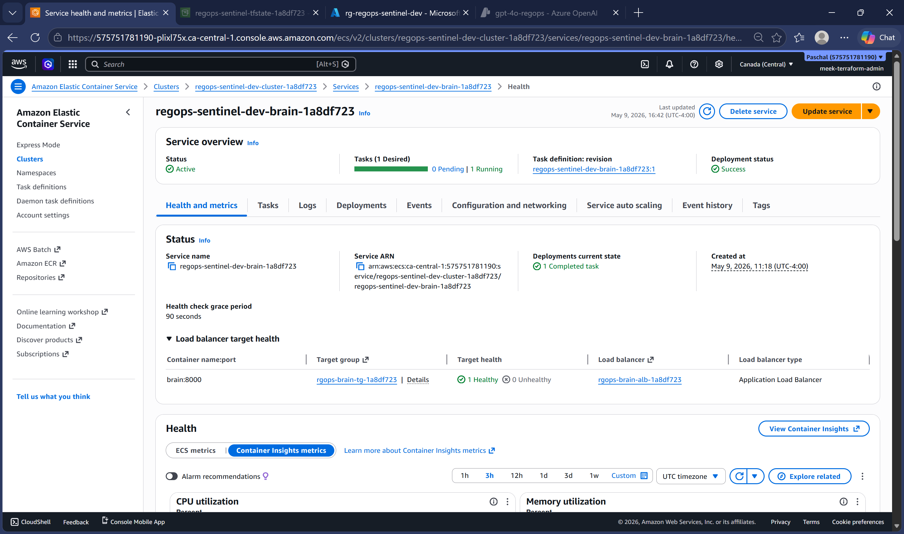

### 3.3 Azure OpenAI metrics confirming real GPT-4o calls

Every classification produces a request to the Azure OpenAI GPT-4o deployment. Azure's metrics dashboard captures these in real time: request count, token usage, latency percentiles, and (importantly) error rates. The latency p95 sits around 1.8 seconds, which is fine for an asynchronous SQS-driven pipeline; the user is never waiting on a single classification call.

The cost story is also visible here. At current volume (roughly 30-50 signals classified per day across both demo tenants), GPT-4o usage runs under $5 per month. This scales linearly with signal volume, so a production deployment with hundreds of distributors could run into real money, but the architecture supports moving to a cheaper model (GPT-4o-mini) per tenant if economics demand.

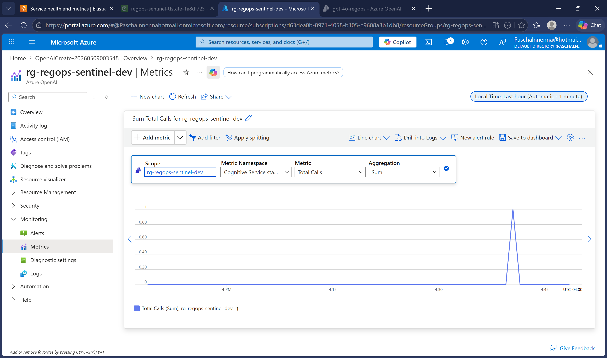

### 3.4 RDS populated with real classified alerts

Classified signals land in the `alerts` table in RDS. Every row is tenant-scoped via the `tenant_id` column, indexed for the cross-tenant `tsvector` search, and references the original S3 audit blob via a content-addressable key. The Window UI's alerts list, alert detail page, and dashboard widgets all read from this table.

A sample row, captured during a real Phase 3 run: an ApexPro Carescape Telemetry Server recall, classified RELEVANT, urgency HIGH, cardiology-devices category, with a one-line summary suitable for display in the alerts list. Real Health Canada signal in, structured tenant-scoped row out.

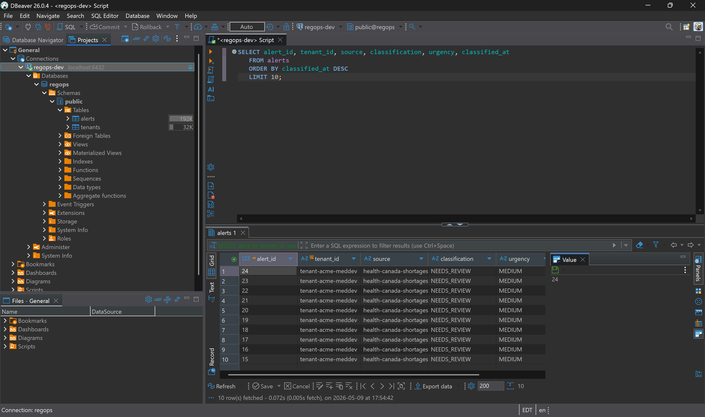

### 3.5 S3 audit blob proving immutable storage

For every classification, the Brain writes a JSON audit blob to S3. The blob captures the input signal, the GPT-4o response, the timestamps, and the actor (system vs user-initiated). The bucket has Object Lock in GOVERNANCE mode with a retention period applied, layered on top of versioning and KMS encryption. Once written, the blob cannot be altered or deleted within the retention window, not even by the bucket owner.

A versioned-delete attempt against a locked object returns `AccessDenied because object protected by object lock`. That's the literal message from AWS, not a bucket policy I wrote. For a regulatory record of record, this is the actual answer to "how do you prove this hasn't been tampered with."

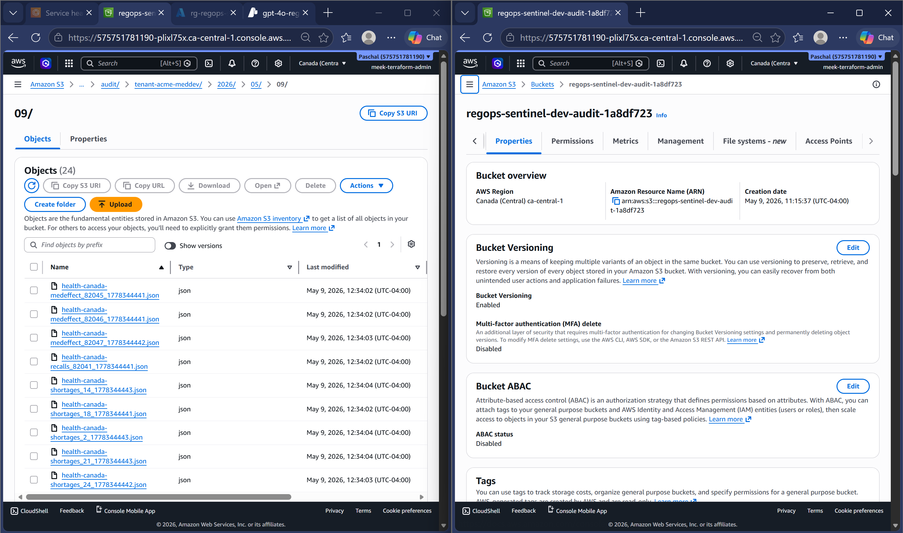

---

## Workstream 4 - The Window (User-Facing App)

The Window is a Next.js application using the App Router, deployed behind Cognito with TOTP MFA enforced. Server components fetch data from the Brain via BFF (Backend For Frontend) route handlers that attach the user's Cognito ID token as a Bearer header before calling the API. The browser never sees the token. Every page on the Window is wired to real data from the Brain; no placeholder rows exist anywhere in the UI.

### 4.1 TOTP MFA enrollment

Every user enrolls a TOTP authenticator on first sign-in. Cognito generates the secret, displays the QR code, and verifies the first 6-digit code before activating the user. SMS-based MFA is not offered; SIM-swap attacks have made SMS a poor second factor for regulated workloads.

This enrollment is a one-time flow. Subsequent sign-ins prompt for the TOTP code after password validation. If the user loses their authenticator, an admin must reset the MFA status in the Cognito console, which itself produces an audit trail.

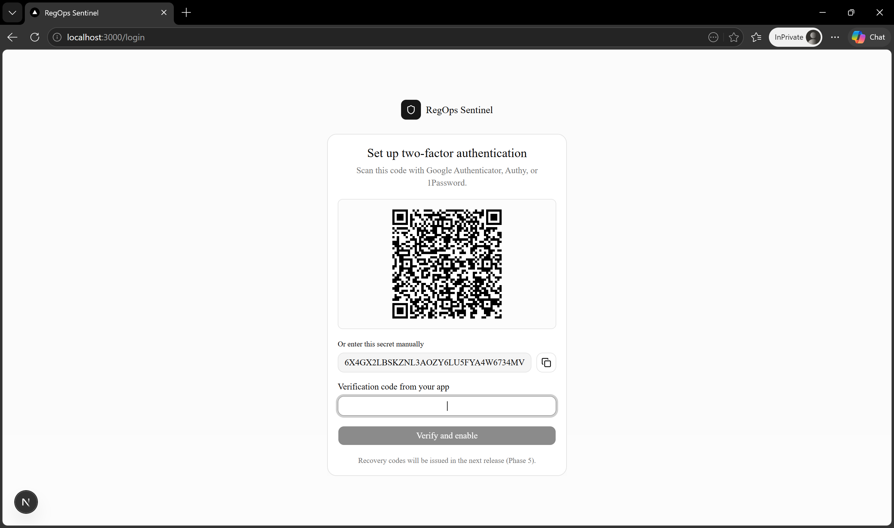

### 4.2 The dashboard

After sign-in, users land on the dashboard. The header shows the tenant name and watcher status ("3 of 3 watchers running on a 30-minute schedule"), pulled from a real `/health/watchers` endpoint on the Brain. Four KPI cards summarize the state: total alerts, relevant alerts requiring distribution review, high-urgency alerts inside the 24-hour response window, and AI-filtered noise.

Below the KPI cards, the Recent Classifications panel lists the last five alerts with priority badges, and the Classification Breakdown donut chart shows the relevant-versus-filtered ratio. The data is real, the rows are tenant-scoped, and the dashboard refreshes on navigation.

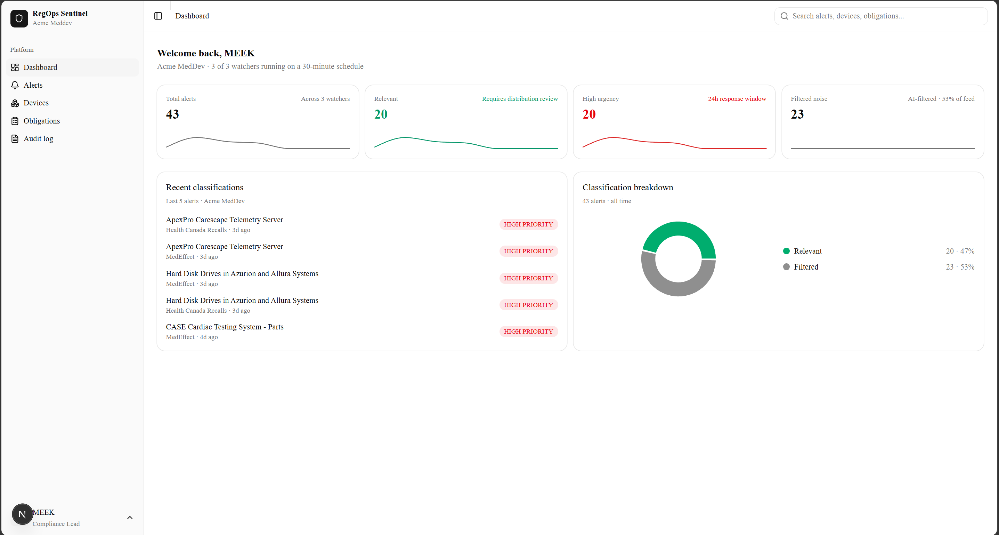

### 4.3 Alert detail page

Clicking a row in the alerts list opens the alert detail page. This is where the AI classification gets surfaced in full: the original Health Canada signal title and body, the GPT-4o classification (relevance, urgency, categories), the one-line summary, the timestamps, and a link to the original Health Canada source.

The detail page is the UX moment that proves the AI is actually useful. A compliance lead reading this page doesn't have to interpret a raw regulatory notice; they see a triaged signal with a clear "is this urgent, does this affect my catalog, what should I do" framing.

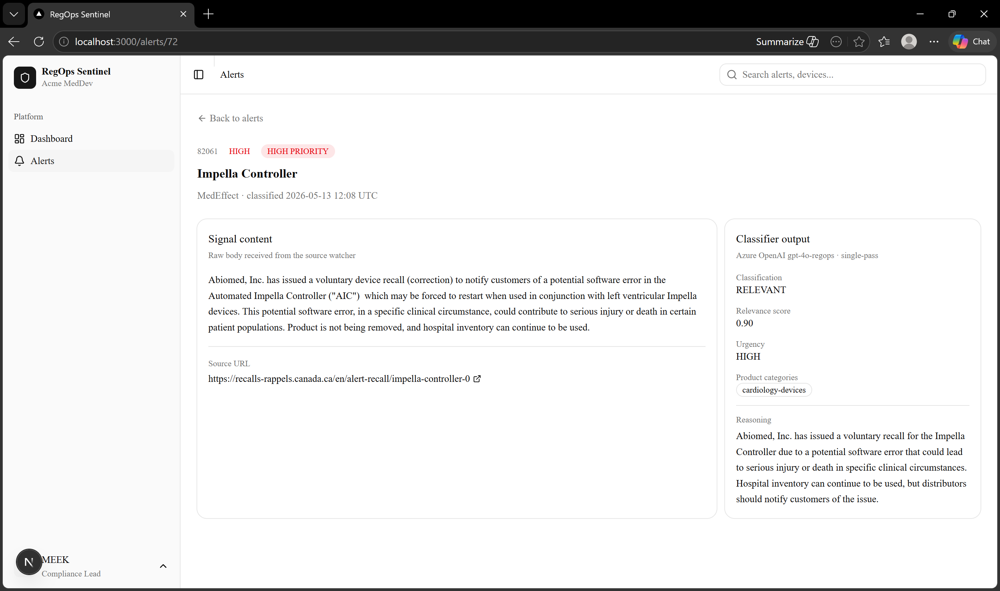

### 4.4 Obligations tracker (CRUD)

The obligations tracker is a tenant-scoped task list for the recurring regulatory work an MDEL holder has to do: MDEL renewals, recall notifications to downstream consignees, distribution record keeping, complaint logging. Each obligation has a title, a description, a due date, an assignee, a status (pending, in-progress, completed, overdue), and an immutable audit trail of every change.

The CRUD flow is full create, edit, complete, and delete from the UI, backed by tenant-scoped API endpoints. Every state change writes an audit blob to S3 with before-and-after snapshots, so the regulatory record of who completed what and when is tamper-evident.

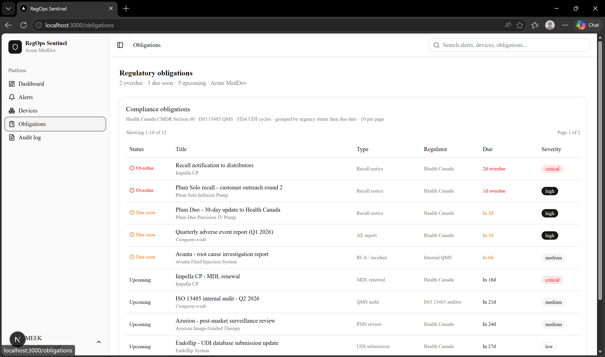

### 4.5 Tenant isolation proof

The hardest thing to demonstrate in a multi-tenant system is that the isolation actually holds. This screenshot is a side-by-side capture of two browser windows: one user signed in as `meek@acme-meddev.test` (Acme MedDev tenant, 43 alerts), one signed in as `sarah@meditech-on.test` (Meditech On tenant, 6 alerts). Same Brain, same database, same S3 bucket. Different data, completely separated.

The isolation is enforced from the Cognito JWT's `custom:tenant_id` claim, never from request input. Every API query reads the JWT first and uses the claim as the database scope. Cross-tenant lookups on detail endpoints return 404 (not 403), because object existence is itself a tenant boundary; leaking "this ID exists but you can't access it" is a security failure.

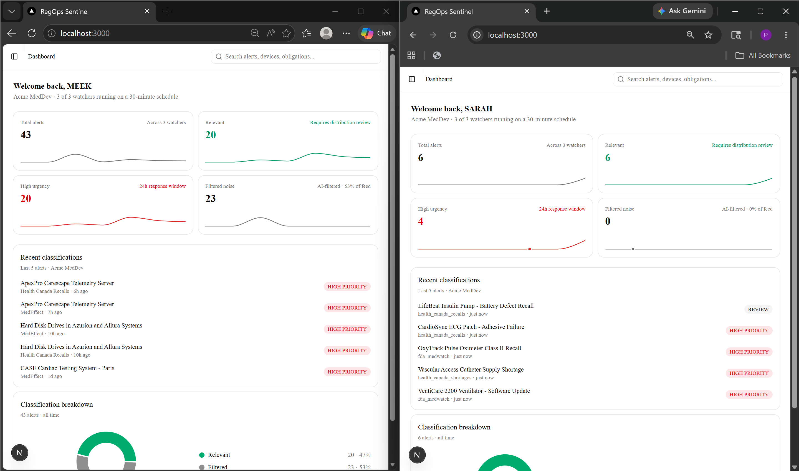

---

## Workstream 5 - Security Hardening

Five layers of defense in depth, configured progressively as the application matured. None of these is the single thing that keeps the system safe; together they form a layered model where a failure in any one layer doesn't expose the data plane.

### 5.1 AWS WAF blocking attack patterns

AWS WAFv2 sits in front of the Application Load Balancer in COUNT mode. COUNT mode means WAF observes and logs traffic patterns matching its managed rule sets (AWS Managed Common Rule Set, Known Bad Inputs, SQL Injection) without actually blocking yet. This is the safe progression: observe real traffic, confirm no false positives against legitimate users, then flip individual rules to BLOCK.

The CloudWatch logs from WAF show what the public internet actually does to an internet-facing ALB. Automated scanners probe `/mcp`, `/jsonrpc`, `/login`, `/.env`, and a dozen other common paths within minutes of the ALB going live. None of them get useful responses, because the Brain's route handlers return 404 for anything that doesn't match a defined route. The WAF logs are evidence that the noise exists; the application's response to that noise is the actual defense.

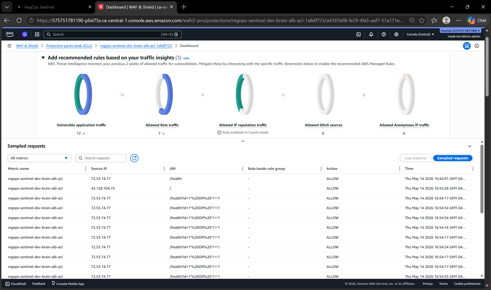

### 5.2 GuardDuty active across the account

Amazon GuardDuty is a managed threat-detection service. It analyzes VPC Flow Logs, DNS logs, and CloudTrail events for anomalies that match known attack patterns: cryptocurrency-mining traffic, communication with known-bad IPs, anomalous API call patterns suggesting credential theft, EC2 instances calling out to command-and-control infrastructure.

Turning GuardDuty on is one of the highest-value-per-effort security moves in AWS. It costs roughly $30-50 per month for an account of this size and runs entirely in the background. The first time it catches something real, it pays for years of subscription.

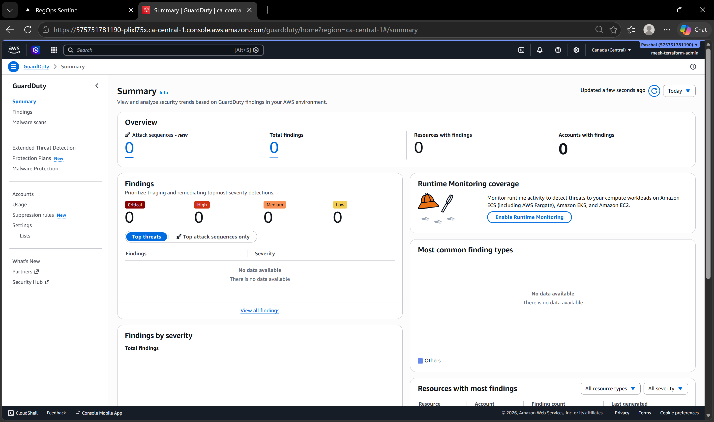

### 5.3 CloudTrail capturing every API call

CloudTrail logs every AWS API call made in the account: who made the call, when, from which IP address, against which resource, with which parameters. The trail in this project is configured to log to a dedicated S3 bucket with Object Lock applied, so the audit log itself can't be altered after the fact.

This matters for two reasons. First, regulatory: any compliance review needs to know who did what in the cloud account. Second, forensic: if something does go wrong (a compromised IAM credential, a misconfigured resource), CloudTrail is the source of truth for reconstructing what happened. Turning it off is one of the first things an attacker tries; logging it to an immutable bucket prevents that.

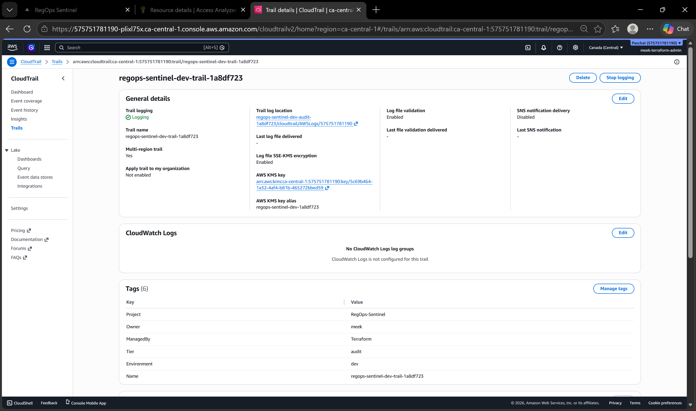

---

## Workstream 6 - Operations and Observability

If you can't see what the system is doing, you can't run it. This workstream wires up the dashboards, alerts, traces, and automation that turn the platform from "it deploys" into "you can operate it."

### 6.1 CloudWatch dashboard with composite alarms

The CloudWatch dashboard pulls metrics from every layer of the stack into one screen: ALB request count and 5xx rate, ECS task CPU and memory, RDS connection count and read/write IOPS, SQS queue depth and message age, Lambda invocation count and error rate per Watcher, Azure OpenAI request volume from the Brain's custom metrics.

Ten alarms watch this dashboard, six metric alarms and four composite. Composite alarms fire when multiple metric alarms are in ALARM state simultaneously, which reduces alert fatigue: a single transient blip on one metric doesn't page anyone, but a sustained pattern across two related metrics does.

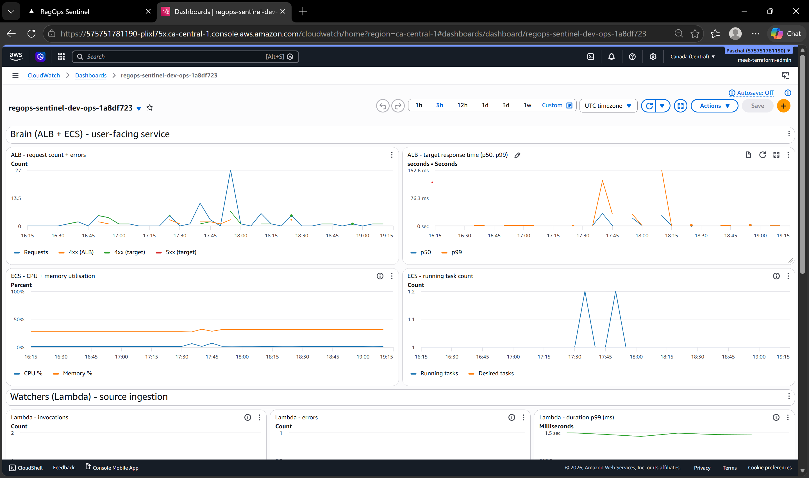

### 6.2 X-Ray service map

The X-Ray service map is the visualization of every distributed trace flowing through the Brain. A single classification produces a trace with spans for the FastAPI request handler, the Cognito JWT verification, the Azure OpenAI call, the RDS insert, and the S3 audit put. The map shows these as a graph with per-edge latency and error rate.

Getting tracing to work end-to-end took five separate fixes across the OpenTelemetry SDK, the ADOT collector configuration, the FastAPI lifespan, the X-Ray trace ID generator, and the BatchSpanProcessor attachment. Each one was a real diagnostic chain, not a config typo. The full story is in `docs/troubleshooting/` for anyone curious; the working result is what's captured here.

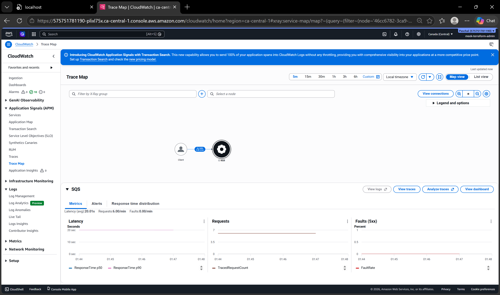

### 6.3 End-to-end recall lifecycle

This screenshot captures a single Health Canada recall flowing through the entire system in real time: published at the source, ingested by the Watcher, queued in SQS, classified by the Brain, stored in RDS, audited to S3, and surfaced in the Window's alerts list. The same recall ID appears at every stage; the elapsed time from publication to user-visible alert is under 20 minutes.

The narrative value of this shot is that it proves the architecture diagrams in `README.md` aren't theoretical. Every arrow on the diagram corresponds to a real component that handled a real signal in this trace.

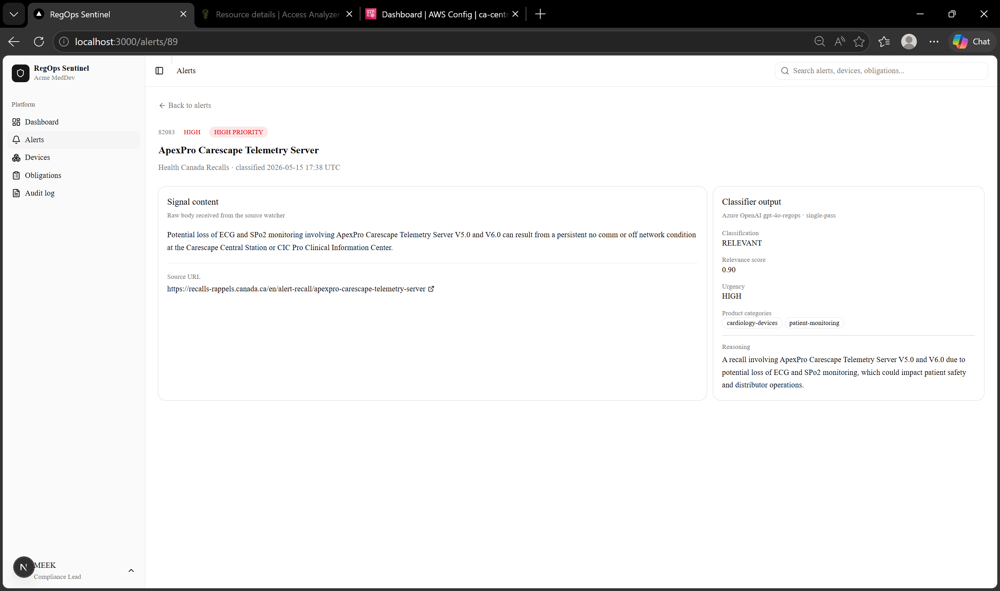

### 6.4 Weekly regulatory digest email

A scheduled Lambda fires every Monday morning, queries the past week's classifications from RDS, formats them into a digest, and sends the result through Amazon SES to every compliance lead in the tenant. The email contains a count of relevant alerts, a summary of the highest-urgency items, and links back to the Window for the full alert detail.

This is the closing of the loop. A compliance lead who has zero alerts in a given week doesn't have to open the app to confirm that; the digest tells them. A compliance lead who has fifteen relevant alerts gets a triaged summary instead of fifteen separate emails. The platform fits into the existing email-driven workflow rather than fighting it.

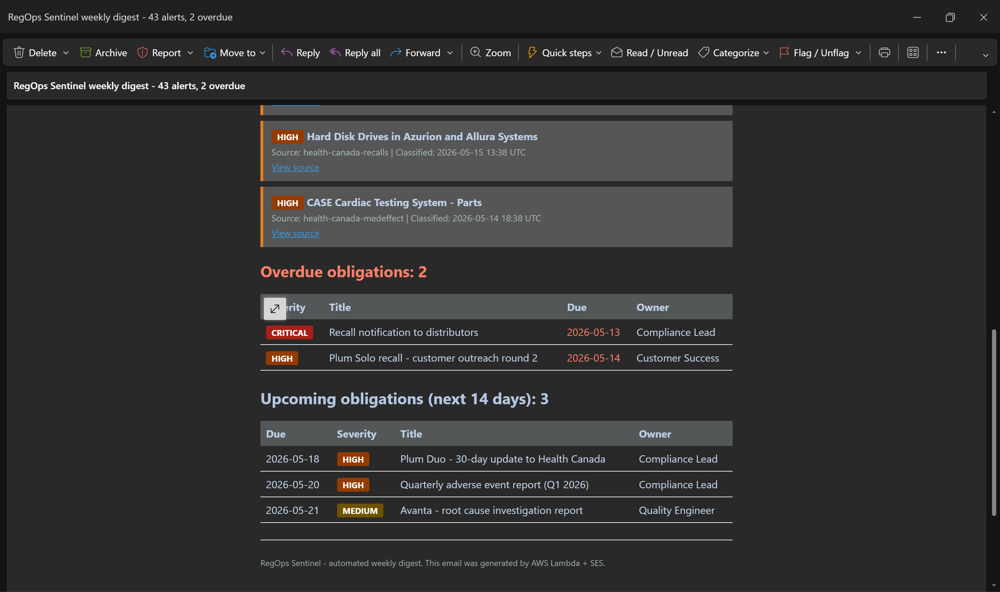

---

## What's Now Running

After the six workstreams, RegOps Sentinel has gone from empty AWS account to operating regulatory intelligence platform:

- **Foundation.** Terraform-managed VPC, RDS Multi-AZ Postgres, Cognito with TOTP MFA, KMS customer-managed keys, Secrets Manager. Everything as code, nothing clicked.
- **Ingestion.** Three Health Canada Watchers running every 30 minutes on EventBridge, publishing to SQS with DLQ protection.
- **AI classification.** FastAPI Brain on ECS Fargate, GPT-4o through Azure OpenAI, with a conservative NEEDS_REVIEW fallback when the AI is unavailable.
- **User-facing app.** Next.js Window with Cognito sign-in, MFA, dashboard, alerts, obligations CRUD, device catalog, audit log, cross-table search. Real data on every page.
- **Multi-tenant isolation.** JWT-scoped from a verified Cognito claim, 404 (not 403) on cross-tenant lookups, separate audit prefixes per tenant.
- **Immutable audit.** S3 Object Lock in GOVERNANCE mode, versioning, KMS encryption, applied to all 84 backfilled audit blobs.
- **Security baseline.** WAFv2 in COUNT mode, GuardDuty, AWS Config, CloudTrail to Object-Locked bucket, IAM Access Analyzer.
- **Observability.** CloudWatch dashboard with 10 alarms (6 metric, 4 composite), OpenTelemetry through ADOT to X-Ray, end-to-end distributed tracing.
- **Operations.** Weekly regulatory digest by EventBridge plus Lambda plus SES. Keyless CI/CD via GitHub Actions OIDC, no stored AWS access keys.

---

## What I'd Do Next

Honest scope-out of what a real production deployment would still need:

- **Self-serve tenant onboarding.** Today, adding a tenant requires a Terraform change plus manual Cognito user creation. A production system needs a tenant-onboarding flow with billing, subscription tiers, and provisioning automation. The SaaS pattern for this is well-documented; it's a build, not a research project.
- **Conditional Access policies on Cognito.** MFA is enforced; what's not enforced is "require MFA only from untrusted networks," "block sign-in from anonymizing IP services," "block legacy authentication." These are standard Cognito advanced security features.
- **RBAC inside the tenant.** Right now every user in a tenant sees everything. A real distributor has a compliance lead, a clinic manager, and physicians; they shouldn't all have the same view. Role-based access control on top of the existing tenant scoping is the next isolation layer.
- **Email and Slack notifications for high-urgency alerts.** The weekly digest is a good baseline. What's missing is "a CRITICAL alert just landed, page the on-call compliance lead now." EventBridge plus SNS plus PagerDuty would do it.
- **Bulk actions, filters, exports.** The tables paginate but don't filter, sort beyond default, or export to CSV or PDF. Compliance teams will absolutely want CSV exports for record keeping.
- **Customer-supplied retention periods.** Object Lock retention is currently a 1-day default for demo purposes. Production would set per-customer retention based on their regulatory regime (typically 7 years for FDA records, 6 years for Health Canada CMDR Section 60 obligations).
- **Move WAFv2 to BLOCK mode.** Currently in COUNT mode while traffic patterns are observed. Once the managed rule sets show zero false positives against legitimate traffic over a 30-day window, flip the rules to BLOCK.
- **Internal-facing ALB.** The Brain ALB is currently public for development convenience. Production would put it behind an authenticated edge (CloudFront with signed URLs, or VPN-only access for the compliance team).

---

## Tech Stack

- **Cloud.** AWS in ca-central-1 (Canadian data residency)
- **Compute.** ECS Fargate (Brain), AWS Lambda (Watchers, scheduled digest)
- **Data.** Amazon RDS Postgres 16 Multi-AZ, Amazon S3 with Object Lock, Amazon SQS
- **AI.** Azure OpenAI (GPT-4o for classification)
- **Identity.** Amazon Cognito with TOTP MFA, custom JWT claims
- **Networking.** Amazon VPC with private and public subnets, Application Load Balancer
- **Security.** AWS WAFv2, GuardDuty, AWS Config, CloudTrail, IAM Access Analyzer, KMS customer-managed keys
- **Observability.** Amazon CloudWatch (metrics, logs, alarms, dashboards), AWS X-Ray, OpenTelemetry via ADOT collector
- **Frontend.** Next.js 14 (App Router), React server components, BFF route handlers
- **Backend.** FastAPI on Python 3.12, psycopg, httpx
- **Email.** Amazon SES for the weekly regulatory digest
- **Infrastructure as Code.** Terraform with the AWS provider and remote state in S3
- **CI/CD.** GitHub Actions with OIDC keyless deploys, ECR for the Brain image, CodeBuild for the source-zip pipeline

---

## Project Context

This is project 14 in a portfolio focused on healthcare IT, cloud architecture, and regulatory technology across the Toronto, Newfoundland, and Ohio markets. The earlier projects (1 through 13) are at [github.com/MEEKMILEZ/azure-cloud-portfolio](https://github.com/MEEKMILEZ/azure-cloud-portfolio) and cover Azure-focused builds (Microsoft 365 administration, AI Ops Intelligence, Prompt Guardian, HelpDesk Zero Touch, M365 Small Business, M365 Enterprise). RegOps Sentinel is the AWS-native counterpart, deliberately built across both cloud platforms to demonstrate hybrid-cloud capability.

For the architectural deep dive (engineering decisions, market context, immutable audit story, multi-audience JWT verification, the X-Ray diagnostic chain), see [README.md](README.md).