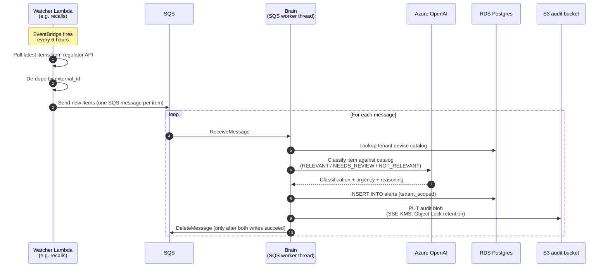

# Architecture

RegOps Sentinel is a multi-tenant regulatory-intelligence platform
for Canadian medical-device distributors. It ingests regulatory
alerts from Health Canada and the FDA, classifies their relevance
to each tenant's device catalog using an LLM, tracks compliance
obligations with a full audit trail, and surfaces everything in a
Next.js UI.

This document is the design-of-record. If the diagrams here drift
from production, fix the diagrams; the system is the source of truth
but this file is what hiring managers, auditors, and future-me will
read first.

## 1. High-level system view

```mermaid
flowchart LR
    subgraph External
        User[User Browser]
        HealthCanada[(Health Canada<br/>Med-Effect)]
        FDARecalls[(FDA Recalls)]
        FDAShortages[(FDA Shortages)]
        AzureAI[Azure OpenAI<br/>GPT-4o]
    end

    subgraph AWS["AWS ca-central-1"]
        Cognito[Cognito<br/>User Pool + MFA]
        Window[Window<br/>Next.js BFF + UI]

        subgraph Watchers["Watchers (EventBridge schedule)"]
            WMed[Lambda<br/>med-effect]
            WRec[Lambda<br/>recalls]
            WShort[Lambda<br/>shortages]
        end

        SQS[SQS<br/>ingestion queue]
        ALB[Application<br/>Load Balancer]
        Brain[Brain<br/>ECS Fargate<br/>FastAPI]

        RDS[(RDS Postgres<br/>Multi-AZ<br/>devices, obligations,<br/>alerts, audit_metadata)]
        S3Audit[(S3<br/>audit bucket<br/>Object Lock + KMS)]
        Secrets[Secrets Manager<br/>DB creds<br/>Azure key]
        KMS[KMS CMK<br/>customer-managed]
    end

    User -->|HTTPS| Window
    Window -->|JWT| Cognito
    Window -->|Bearer JWT| ALB
    ALB --> Brain

    HealthCanada --> WMed
    FDARecalls --> WRec
    FDAShortages --> WShort
    WMed --> SQS
    WRec --> SQS
    WShort --> SQS
    SQS --> Brain

    Brain --> AzureAI
    Brain --> RDS
    Brain --> S3Audit
    Brain -.reads.-> Secrets
    S3Audit -.encrypted with.-> KMS
    RDS -.encrypted with.-> KMS
```



**What this shows.** The three regulatory data sources feed three
Lambda watchers on a schedule. Each watcher pushes raw items to a
single SQS queue, which the Brain drains via a daemon thread on its
ECS task. The Brain calls Azure OpenAI to classify each item against
the tenant's device catalog, writes the classified row to RDS, and
writes an immutable audit blob to S3.

Separately, users hit the Window through the ALB. The Window is a
Next.js app with a "BFF" pattern: server-side route handlers attach
the user's Cognito JWT to upstream Brain calls so the browser never
sees the token directly.

Everything sensitive (S3 audit data, RDS at-rest) is encrypted with
a single customer-managed KMS key.

**Trust boundaries.**

- **Public:** ALB, Cognito hosted UI, Window app (when deployed).
- **Tenant-scoped:** Brain endpoints. Every endpoint reads
  `tenant_id` from the verified JWT, never from request input.
- **Brain-internal:** RDS, S3 audit bucket, Secrets Manager.
  Reachable only from inside the VPC by the Brain's ECS task role.

## 2. Alert pipeline data flow

This is the path a single regulatory alert takes from the moment a
Watcher pulls it from a regulator's site to the moment it appears in
the user's Alerts table.



**What this shows.** A 4-step pipeline per alert: pull, classify,
persist, audit. The brain only acknowledges (DeleteMessage) after
BOTH the DB write AND the audit-blob write succeed. If either step
fails, the message returns to SQS for retry; the visibility timeout
window prevents duplicate work during the retry.

**Why this matters for compliance.** Regulators require evidence
that classification decisions are traceable. The audit blob captures
the full source item, the classification result, the timestamp, and
the model output (reasoning) - everything an auditor would need to
reconstruct a decision months later. Object Lock means the blob
cannot be modified or deleted within its retention window, even by
an account-level admin.

**Why SQS instead of direct Watcher-to-Brain calls.** Decoupling
gives us:

- **Burst tolerance.** Watchers can return 100+ items in a single
  invocation; the Brain processes them at its own rate without
  rate-limiting the watcher.
- **Retry safety.** Azure OpenAI hiccups (rate limits, transient
  5xx) replay automatically via SQS visibility timeouts; no custom
  retry code in the watchers.
- **Independent scaling.** Watchers run on Lambda; Brain runs on
  ECS. Each scales on its own signal.

## 3. User action data flow (obligation CRUD)

This is the path a user-initiated action (create/edit/delete an
obligation) takes from the browser to the immutable audit log.

```mermaid
sequenceDiagram
    autonumber
    participant U as User Browser
    participant W as Window<br/>(Next.js BFF route)
    participant C as Cognito
    participant ALB as ALB
    participant B as Brain<br/>(FastAPI)
    participant DB as RDS Postgres
    participant S3 as S3 audit bucket

    Note over U,W: User clicks<br/>"Mark complete" on a row
    U->>W: POST /api/obligations/123/complete<br/>(session cookie)

    W->>W: Read encrypted Amplify session cookie
    W->>W: Extract Cognito ID token
    Note over W: Token never sent to browser;<br/>server-side only

    W->>ALB: POST /obligations/123/complete<br/>Authorization: Bearer <id_token>
    ALB->>B: Forward

    B->>C: Fetch JWKS (cached)
    B->>B: Verify JWT signature + claims<br/>(iss, aud, exp, tenant_id)

    B->>DB: SELECT current row<br/>(tenant-scoped)
    DB-->>B: row snapshot (before)
    B->>S3: PUT audit blob<br/>action=obligation_complete<br/>actor=user.sub<br/>before+after snapshots
    Note over S3: SSE-KMS,<br/>Object Lock retention
    B->>DB: UPDATE obligations<br/>SET status='completed',<br/>completed_at=NOW()

    B-->>W: 200 OK + updated row
    W-->>U: 200 OK + updated row

    U->>U: router.refresh()<br/>(re-fetches list)
```

**What this shows.** Three notable security properties:

1. **The browser never sees the Cognito ID token.** It's stored in
   an encrypted session cookie that only the Window server can
   decrypt; the BFF route attaches the token to the upstream Brain
   call server-side. The browser only ever holds the opaque session
   cookie.

2. **The audit blob is written BEFORE the DB mutation.** Reversing
   this order would create a window where the DB row could change
   without a corresponding audit record (if the audit write failed
   between the DB commit and the audit PUT). The current order
   means: if the audit fails, the mutation never happened from a
   user's perspective. The brain returns 500 and SQS-style retry
   semantics do not apply since this is a synchronous user action.

3. **Tenant scoping is enforced server-side from the JWT claim.** A
   user cannot send a forged `tenant_id` in the request body to
   read or mutate another tenant's data. The `current_user`
   dependency extracts `tenant_id` from the verified JWT and every
   SQL query joins on it.

**Why the audit blob includes "before" AND "after" snapshots.** On
update operations, an auditor needs to know not just what changed,
but what it was before. Storing the diff alone would lose this
information once the operational row is mutated. Storing both
snapshots makes every audit blob self-contained.

## Cross-cutting concerns

### Tenant isolation

Multi-tenant SaaS uses one of three isolation strategies: separate
databases per tenant, separate schemas per tenant, or shared schema
with `tenant_id` columns. We use shared-schema with `tenant_id`
columns because:

- One RDS instance is cheaper than N at our scale.
- Tenant migration becomes a database migration (one place to
  update), not an orchestration problem.
- Every query against tenant-scoped data joins on `tenant_id`,
  enforced at the SQL layer. The Brain's `current_user.tenant_id`
  comes from the JWT and is never overridden by request input.

This is the same pattern used by Stripe, Linear, Notion, and most
modern SaaS at our scale.

### Audit immutability

The audit bucket has three layers of immutability:

1. **Object Lock in Governance mode** with a retention period
   matching the longest applicable retention requirement (Health
   Canada CMDR records: 5 years; FDA records: 2 years; we use 7
   years to cover both with margin).
2. **Versioning enabled** so even a successful delete leaves the
   prior version retrievable.
3. **KMS encryption** with a customer-managed key whose policy
   restricts decryption to the Brain's ECS task role (no
   account-level admin can read audit blobs through the console).

### Observability

- **Structured JSON logs** via `python-json-logger` go to
  CloudWatch Log Groups (`/aws/ecs/regops-sentinel-dev-brain-*`).
- **VPC flow logs** capture every network connection for forensic
  reconstruction.
- **GuardDuty** monitors the account for anomalous API patterns.
- **WAF** in COUNT mode (currently) logs would-be blocks; tuning
  to BLOCK mode after baseline.

### CI/CD

Three GitHub Actions workflows run on every push to main:

- `brain-ci`: pip-audit, py_compile, Docker build dry-run.
- `window-ci`: npm audit, tsc, next build.
- `terraform-ci`: fmt -check, validate.

Production deploys still happen on AWS CodeBuild + ECS rolling
deploys; CI is purely a sanity gate before merge. See
`.github/workflows/` for the workflow definitions.

## Known limitations

These are honest tradeoffs, not bugs:

- **No auto-deploy from CI.** The CI workflows do not push images
  to ECR. A merge-to-main triggers no AWS-side action. Manual
  deploys via CodeBuild + ECS rolling update. Adding auto-deploy
  requires GitHub OIDC -> IAM role-assumption; out of scope for
  the current phase.
- **Window not yet deployed.** The Next.js app runs locally
  against the deployed Brain. Production Window will go to
  Amplify Hosting or ECS Fargate in a future phase.
- **Single region (ca-central-1).** Health Canada data residency
  drove the region choice. A multi-region story (US-mirror for
  FDA-only customers) is a future-phase question.
- **No service mesh.** The Brain is a single FastAPI process per
  ECS task. As the system grows (e.g., a separate ingestion
  service, a separate notification service), we may want a
  proper service mesh; for now, in-process is simpler.

## Component versions (as of this commit)

| Component | Version | Notes |
|---|---|---|
| Brain runtime | Python 3.12 | python:3.12-slim base |
| Window runtime | Node.js 22 | Next.js 16.2.6 (Turbopack) |
| Watchers runtime | Python 3.12 | Lambda |
| PostgreSQL | 16.13 | RDS Multi-AZ |
| Terraform | 1.9+ | aws provider ~> 5.0 (resolved 5.100.0) |
| OpenAI SDK | 1.109.1 | held back from 2.x; see Phase 5C.3 |